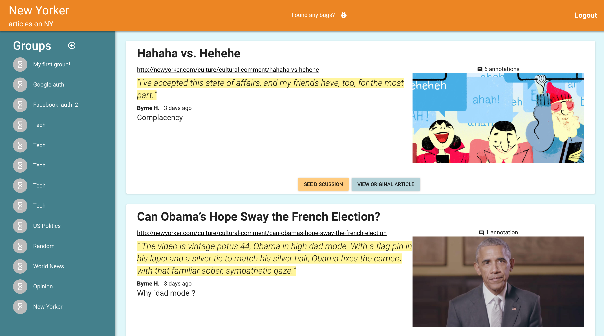
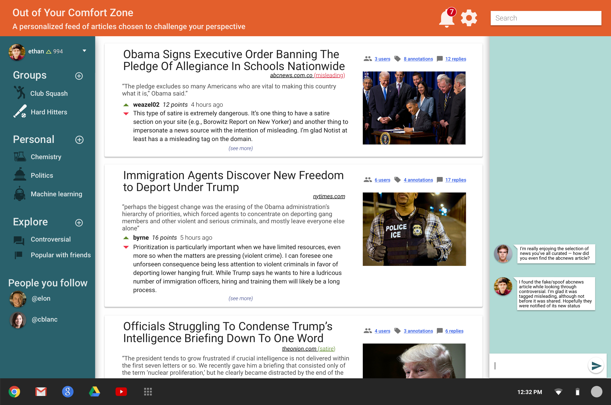
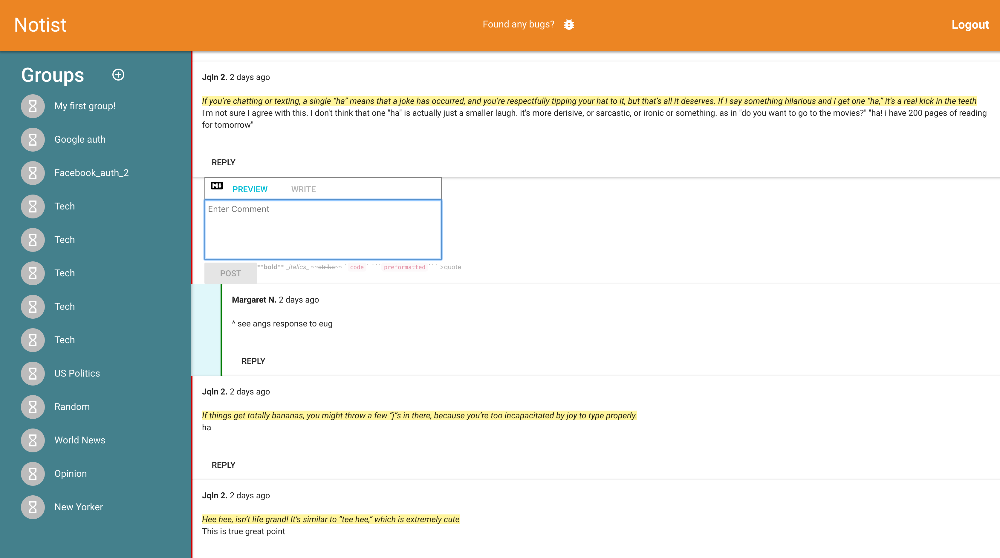

Here's the repo for Notist's client. We're hosting it on Heroku at http://notist.io. We are hosting out API on Heroku under a different project and using TLS for all requests to and responses from our API. (We currently don't have an SSL cert for our client but will probably get one soon.)

You can learn more about Notist on [our about page](http://about.notist.io).

<!-- - For chat on the right side, just need an empty, collapsible drawer (will later integrate with socket.io) -->

How to run:
- `npm i`
- `npm start`

